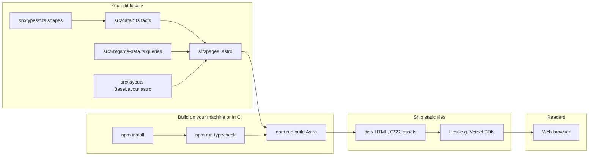

# Pokopia player guide (starter site)

Fan guide built with **Astro**: narrative copy and structured game facts both live in **TypeScript** (`src/data/copy/`, `src/data/*.ts`), and routes are **`.astro` pages** that import that data. Same pattern teams use before plugging in a real API or database.

---

## Astro and Starlight — super simple

**Imagine you wrote a bunch of posters** (your words, tables, and game facts). **Astro** is the workshop that takes those posters and **glues them into one finished museum exhibit** people can walk through on the web. It outputs plain **HTML files** (the language browsers understand), so the site loads fast and you can host it almost anywhere.

- **You write:** Page templates (`.astro`), TypeScript content and data (`.ts`), and shared UI (`.astro` components).
- **Astro does:** Combines them, fills in the layout (header, nav, footer), and runs **`npm run build`** to create a folder called **`dist/`** full of ready-to-show pages.

**What about Starlight?** Starlight is an **extra kit built on top of Astro** made especially for documentation sites (search box, sidebar, “docs” look). It is like Astro giving you a **pre-decorated room** instead of an empty workshop. **This project uses plain Astro, not Starlight** — fewer moving parts while you learn TypeScript — but you could add Starlight later if you want a bigger docs-style site.

---

## Picture of the architecture

Who touches what, from your keyboard to a reader’s screen:



**Reading the diagram:** facts and types feed the pages; the layout wraps every page; Astro turns all of that into `dist/`; the host copies those files to computers around the world; the browser shows them. No database is required for this version — everything is **pre-baked** at build time.

---

## What each step means (parent + kid cheat sheet)

| Step | Command or action | What it actually does |
|------|-------------------|------------------------|
| **Install Node.js** | Download from [nodejs.org](https://nodejs.org/) | Installs **Node**, the program that runs JavaScript on your computer (not just in the browser). **npm** comes with it — that is the “app store” for small building blocks your project needs. |
| **Install dependencies** | `npm install` | Reads `package.json`, downloads **Astro** and other tools into `node_modules/`. You do this once per clone, or after dependencies change. |
| **Typecheck** | `npm run typecheck` | **TypeScript checks** your `.ts` and `.astro` files without opening the site: “Do all the pieces fit? Are ability ids spelled right?” Catches mistakes before deploy. Same idea as the **CI** job on GitHub. |
| **Dev server** | `npm run dev` | Starts a **local preview** on your PC with **hot reload**: change a file, refresh the browser (or it auto-refreshes). Not the final site — for building and experimenting. |
| **Production build** | `npm run build` | Astro **compiles** everything into **`dist/`**: real `.html` files you could open as files or upload to a host. Optimized for speed. |
| **Preview build** | `npm run preview` | Serves **`dist/`** locally so you double-check what readers will get (links, 404, layout). |
| **Git commit & push** | `git add` / `commit` / `push` | Saves a **snapshot** of your code and sends it to GitHub (or similar). Like a saved game, but for your project. |
| **Connect to Vercel (etc.)** | Import repo in the host’s dashboard | The host pulls your code, runs **`npm run build`**, and puts **`dist/`** on their **CDN** (fast copies worldwide). Future pushes can auto-rebuild. |

---

## Big ideas (for a new builder)

1. **TypeScript (`src/types`, `src/data`, `src/lib`)** — Define *shapes* (`interface`) once; guide text lives in `src/data/copy/`, game rows in `src/data/*.ts`.
2. **Astro** — Builds static **HTML** in `dist/` from `.astro` components and imported `.ts`. Fast global CDN hosting stays free for small sites.
3. **Interactive islands (later)** — Add React/Vue/Svelte components with `client:*` when you want search, filters, or richer UI without leaving Astro.
4. **Git + CI** — Push to GitHub; Vercel (or similar) runs `npm run build` on every change. `npm run typecheck` is what you add to a real pipeline next.

---

## Architecture (enterprise-style, still small)

| Path | Purpose |
|------|---------|
| `src/types/game.ts` | Domain types: `PokemonSpecies`, `Ability`, `HabitatBlueprint`. Change these when your mental model of the game gets richer. |
| `src/data/*.ts` | Plain **registries** (arrays of objects). No UI here — easy to replace later with `fetch()` to your API. |
| `src/lib/game-data.ts` | **Query helpers** (`getPokemonBySlug`, `getSpeciesUsingAbility`, …). Pages import from here, not from raw arrays, so indexing/caching stays in one place. |
| `src/pages/**/*.astro` | **Routes** that compose layout + data (e.g. `[slug].astro` dynamic routes). |
| `src/data/pokopia-dex.json` | **Pokédex bundle:** all species, Pokopia specialties, habitat guide text, sources. Also copied to `public/data/` for `fetch('/data/pokopia-dex.json')` in the browser. |
| `src/data/copy/*.ts` | Guide **copy** as typed objects (`Article`, `HomeContent`). |
| `src/components/*.astro` | Reusable markup (e.g. `ArticleBody`). |
| `src/layouts/BaseLayout.astro` | Shared chrome; nav and footer. |
| `dist/` | Build output — deploy this (or let the host run `npm run build`). |

To **add a species**: edit `src/data/pokemon.ts` (and link abilities by `id`). To **add an ability**, edit `src/data/abilities.ts` and reference its `id` from species. Detail URLs are `/pokemon/<slug>`.

---

## Run the site on your computer

### 1. Install Node.js

Install **Node.js 20.19+** or **22 LTS** from [nodejs.org](https://nodejs.org/) (older 20.x releases can trigger `EBADENGINE` warnings from tooling). If you use [nvm-windows](https://github.com/coreybutler/nvm-windows), the repo includes `.nvmrc` with `20.19.0`.

### 2. Install dependencies

```powershell
cd C:\Source\Pokopia
npm install
```

If `npm ci` ever fails with `EPERM` on Windows, close other programs using the folder (dev server, antivirus scan), then run `npm install` again.

### 3. Full local verification (typecheck + production build)

```powershell
npm run verify
```

### 4. Start the dev server (live editing)

```powershell
npm run dev
```

The dev server listens at **`http://127.0.0.1:4321`** (fixed in `package.json` so the URL never changes).

### 5. View in Cursor’s Simple Browser

1. Run **`npm run dev`** in a terminal (or VS Code/Cursor task **“dev: Astro”**).
2. Command Palette: **“Simple Browser: Show”** (or **“Simple Browser: Show (External)”**).
3. Open: `http://127.0.0.1:4321`

That is the same site as in Chrome, but docked inside the editor.

### 6. Production build + preview (optional)

```powershell
npm run build
npm run preview
```

Then open **`http://127.0.0.1:4321`** again (preview serves the `dist/` folder).

---

## Deploy for free

Same as before: connect the Git repo to [Vercel](https://vercel.com/), [Cloudflare Pages](https://pages.cloudflare.com/), or [Netlify](https://www.netlify.com/). Build: `npm run build`. Output: **`dist`**.

Optional: add a GitHub Action that runs `npm run typecheck` and `npm run build` on every pull request — good practice for your son to see early.

---

## Trademark note

This template is for **educational / fan-guide** use only. Do not claim an official affiliation, and respect the game creator’s terms and intellectual property.
